```{r setup, include=FALSE}
knitr::opts_chunk$set(echo = TRUE)
```
## **1. The Original Visualization**
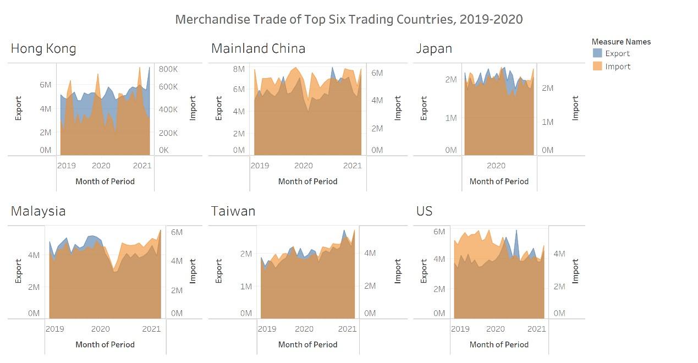

## **2. Critics**

### Clarity:

*	Inconsistent time period

Like the chart of Japan which only provided the data during 2020 less than other chart.it could decrease of the persuasion of data.

*	Inconsistent unit f axis

There are two axises in one chart which present the value with same nature ,the difference could mislead the understanding of the viewers

* Lack of unit of measurement

It doesn’t show how value the trade which cannot supportive to explain the data

* Lack of commentary and necessary annotation

It makes viewer take more time to understand the data

*	Broad title 

Do not tell the main  point of the data

### Aesthetics:
*	Chart details

* Unsuitable size of the title

The subtitle of each chart is bigger than the total title make reader hard to notice the main title

* Unsuitable type of chart

As the discrete type of data, it more suitable be presented in bar chart

* Unaligned chart

## **3. Proposed Design**

### 3.1 Sketch


### 3.2 Advantages of Proposed Design

* Clear title – shows the main story the data tells make reader understand easily

* Add concise commentary to support the commentary

* With the consist unit to make data comparable among the top6 regions

*	Consistent color through the whole dashboard

* Enrich the data story by provide a overview of the data topic

* Show clearly about the difference between import and export

* Add necessary annotation to stress the importance information


## **4. Data Visualisation Steps**

### 4.1 Preparation of data

i) Delete the unnecessary data by excel—useless old data
 
ii)	By excel function with offset, transform and selection to select the desired data

iii)	Export the managed data to a new file named “managed data.excl”

### 4.2 Visualization of data

i) Import the new data file into the tableau

ii) Change the data type—column “date” to data type

### 4.2.1	Overview tab

* Import relative data

Drag [Merchandised Import] and [Merchandised Export] to Rows and drag [Day] to Columns.


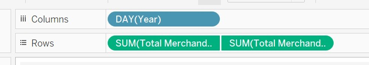

* Apply Filter

Drag [Merchandized Export] to Filters panel

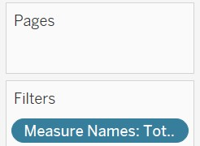

* Apply color

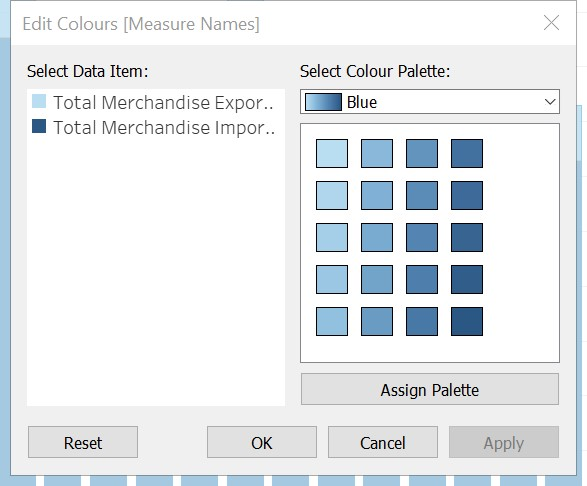

* Edit axis

Make the two range of the axis are same and rename the axis to export and import to clearly presented.

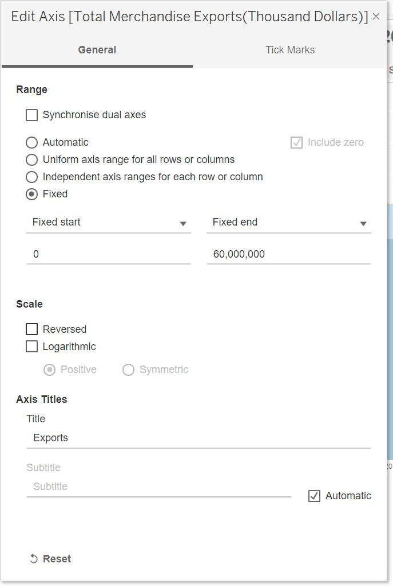

* Shade the axis color to match the chart color

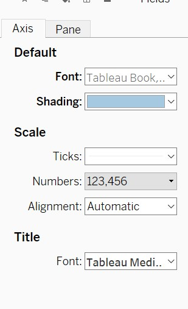

* Add title and commentary

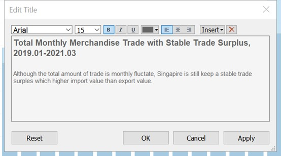

* The final results

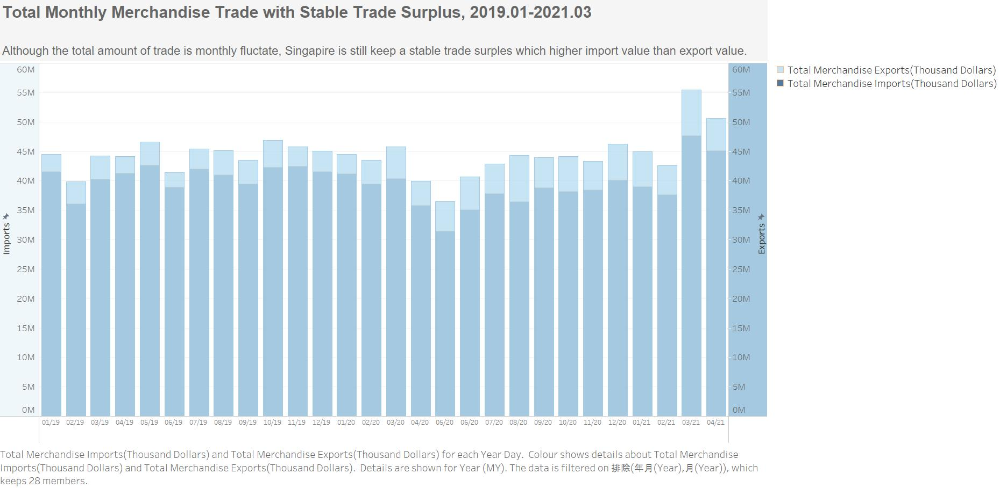

### 4.2.2 Top Regions Tab

* Import relative data

Drag [Merchandised Import] and [Merchandized Export] to Rows and Columns respectively

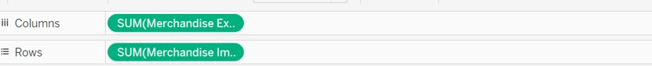

* Add new calculated filed 

Named total value which equals :[ total merchandised import] add [total merchandised export]

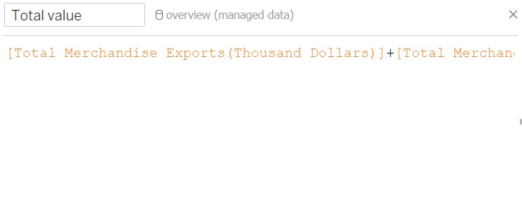

* Drag the [Total value] to size, drag the [Region/Markets] to color.

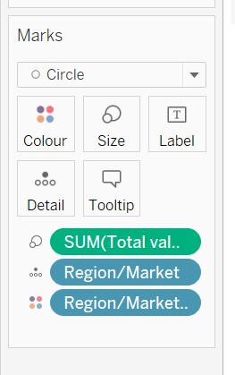

* Group the top6 regions and color them to differentiate with others.

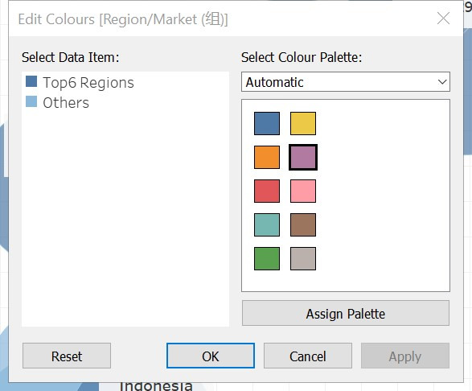

* Add annotation to stress the information

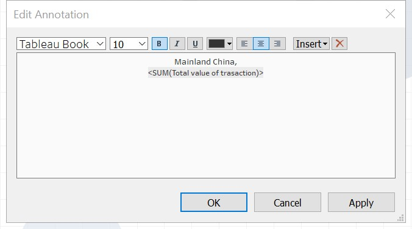


* Add the title and commentary

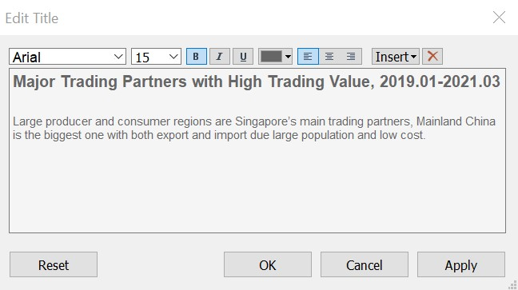
* Add the title and commentary

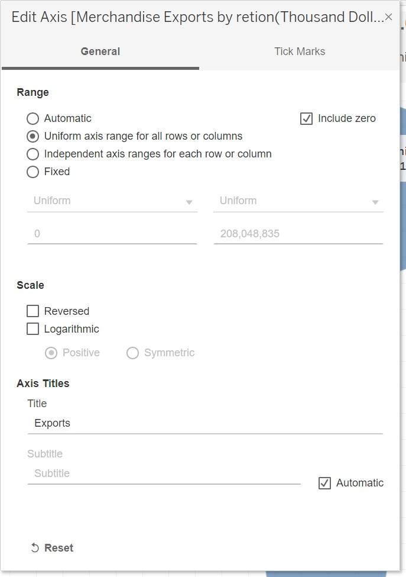

* The final results

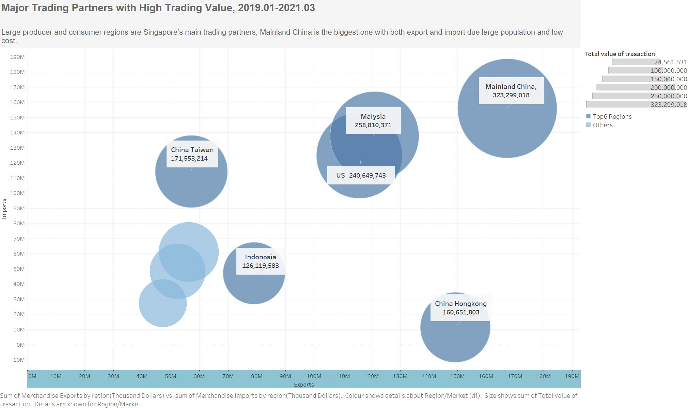

### 4.2.3 Top Region Monthly Distribution Tab

* Import relative data

Drag [Merchandized Import], [Merchandized Export] and [Region/Markets] to Rows and drag [Date] to Columns 


* Edit the axis

Make the axis to reverse, fixe the axis range and rename the axis

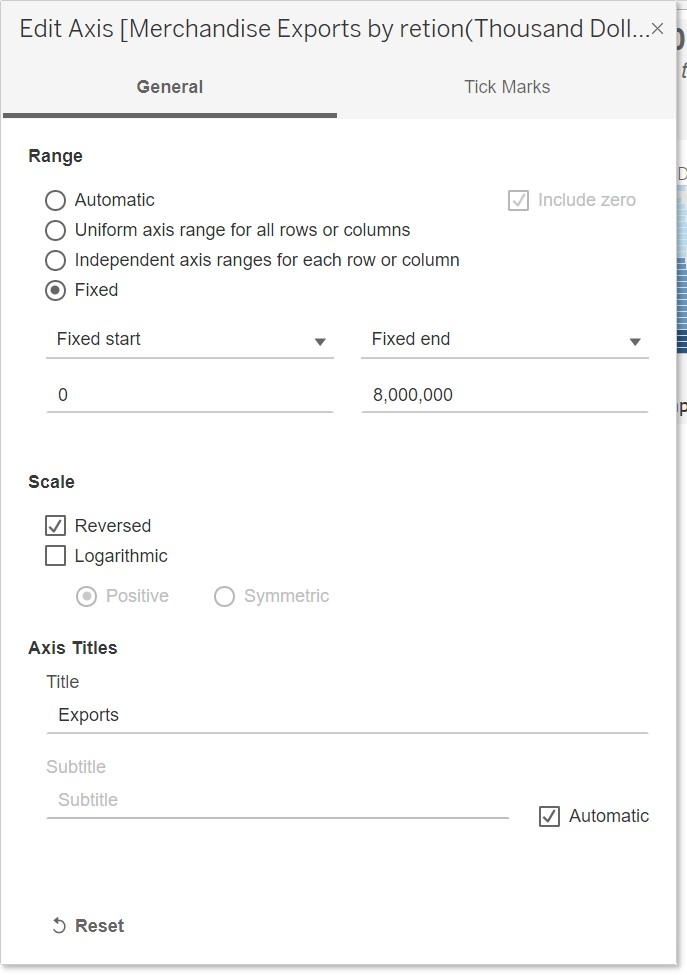

* Sort the display by region 

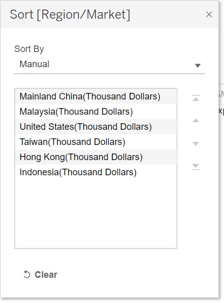

* Color the chart in terms of the year periods

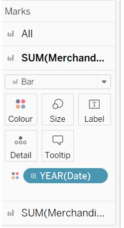

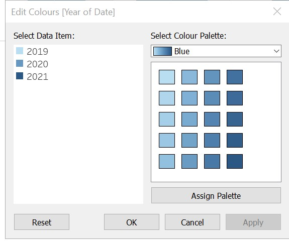

* Add the title and commentary

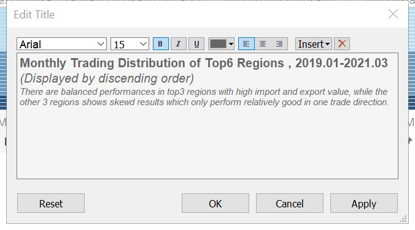

* The final results

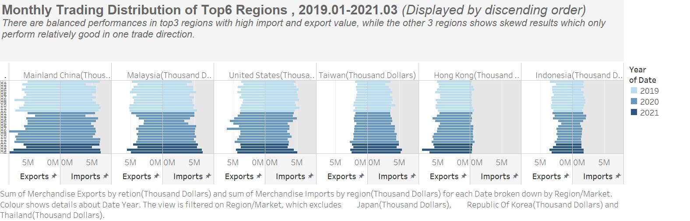

### 4.2.4 Dashboard 

* Select size - automatic


* Drag the charts and make layout to show appropriatly 


* Add source

Using Objects > Text > drag to bottom and add data source and notices


* Add author

Add text to bottom left corner and add text : “DataViz Makeover #1 by HUANG SHAN (shan.huang.2020@mitb.smu.edu.sg) align left

* The final results

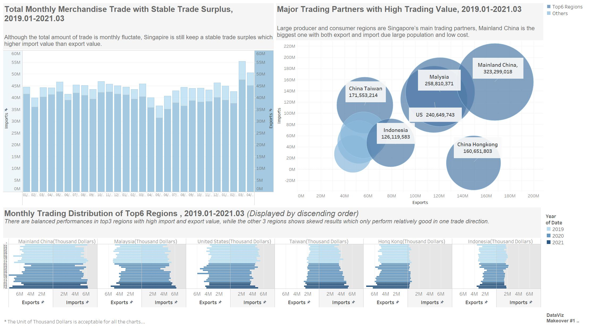

## **5.  Main Observations**

* Although the amount value of trade shown volatility during the period from 2019.01 to 2021.01, the Singapore still keep a relatively stable trade surplus, especially, in the current year, the amount trade has increased compared with the pass time

* The major trade partners in Singapore divided into two groups, one is the big region which has large consumer power or producer ability, another one is the neighbor countries which have close distance and low cost (like transportation cost.etc)

*	Compared with the trade value distribution among the top6 regions, it obviously tells that the top 3 regions which have large population show relatively higher demand both in import and export, while the other 3 regions with small areas and population, could always show the imbalance in the two converse direction trade,like Taiwan is an important supplier for Singapore while it doesn't heavily dependent on Singapore


