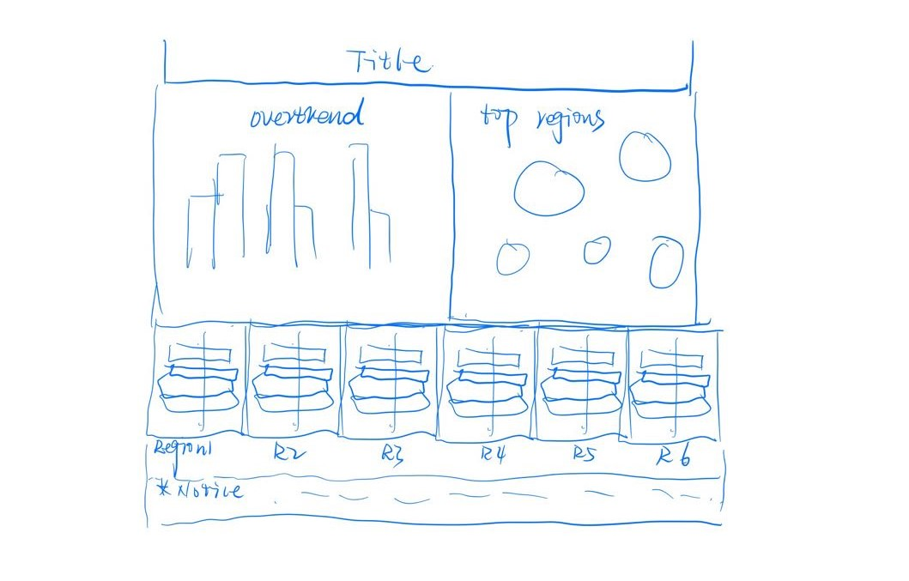

---
title: "Makeover3"
author: "HUANG Shan"
date: "6/20/2021"
output:   
  distill::distill_article:
    self_contained: false

```{r setup, include=FALSE}
knitr::opts_chunk$set(echo = TRUE)
```

## R Markdown
## **1.	Introduction**
This makeover aims to explore different perspectives and approaches to improve the original visualization.
The original visualization tried to present the performance of Singapore’s major merchandise trade partner.
Here is the row chart from (Department of Statistics, Singapore)


## **2. Critics of original visualization**

### Clarity:

*	Missing units in Y-axis and X-axis

Just show the absolute number in Axis without explanation, it could confuse viewer to compare the import value and export value easily and correctly.

*	Inconsistent of content between chart and comments

The data presented in chart based on 2020 while the comment gives the conclusion for past years. Obviously, there are no enough information to support the idea.

* Meaningless of grouped color for circles

There are no principle to define the color group. For example, the color in Thailand and EU are same, but no similar characteristics shown. It would mislead the user to get the right information.

* Lack of necessary information 

For the annotation in the visualization, just show a single amount but not explain the meaning of the number, reader cannot conclude the value whether is means trade surplus value or total trade value 

*	Indirectly presentation

By the center point to present the region whether is net importer or exporter are not directly enough let viewer detect the net trade status at a glance

Icon of import and export also not easily to get the meaning

### Aesthetics:
*	Chart details

The annotation have over the zone of the visualization which look like unnice.

* Unsuitable size of icon

As the chart shown, the icon of net export and net importer are not easy to identify without other information, so obviously is not a good indicator in the visualization

* Unsuitable type of chart

As the discrete type of data, it more suitable be presented in bar chart

* Unsuitable size of annotation

The explanation of icon is bigger than the comment which could miss the importance

## **3. Proposed Design**

### 3.1 Sketch



### 3.2 Advantages of Proposed Design

* Add past trade performance data to support the comments

* Interactive the line chart on tooltip enable user could see the relative past information when mouse hoke the specified shape

* Use national flag to present the each region to improve the aesthetics and comprehensible

*Make up the annotation，add information to dispaly the meaning of each value 

* Use words instead of graph to present the net porter and exporter

* Add units for the axis

* Add filter based on date to support user can view yearly trade performance


## **4. Data Visualisation Steps**

### 4.1 Preparation of data

i) unzip the file and drag the file to anywhere in the interface
图
 
ii)	Use the data interpreter to select useful data

iii)	Drag T1 to XX, add filter

### 4.2 Visualization of data

i) Import the new data file into the tableau

ii) Change the data type—column “date” to data type


This is an R Markdown document. Markdown is a simple formatting syntax for authoring HTML, PDF, and MS Word documents. For more details on using R Markdown see <http://rmarkdown.rstudio.com>.

When you click the **Knit** button a document will be generated that includes both content as well as the output of any embedded R code chunks within the document. You can embed an R code chunk like this:

```{r cars}
summary(cars)
```

## Including Plots

You can also embed plots, for example:

```{r pressure, echo=FALSE}
plot(pressure)
```

Note that the `echo = FALSE` parameter was added to the code chunk to prevent printing of the R code that generated the plot.
