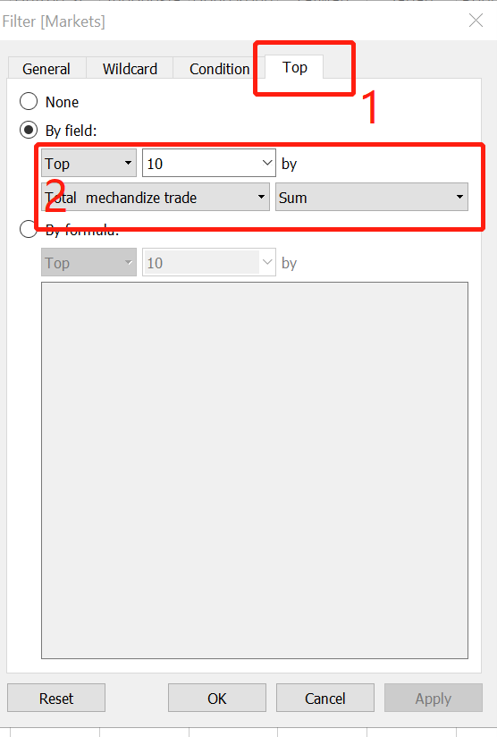

```{r setup, include=FALSE}
knitr::opts_chunk$set(echo = TRUE)
```


## **1.	Introduction**

This makeover aims to explore different perspectives and approaches to improve the original visualization.
The original visualization tried to present the trade performance of Singapore's major  partner.

Here is the raw chart from  (https://www.singstat.gov.sg/modules/infographics/singapore-international-trade)


## **2. Critics of original visualization**

### Clarity:

*	Missing units in Y-axis and X-axis

Just show the absolute number in axis without explanation, it could confuse viewer to compare the import value and export value easily and correctly.


*	Inconsistent of content between chart and comments

The data presented in chart based on 2020 while the comment gives the conclusion for past years. Obviously, there are no enough information to support the comment.


* Meaningless of grouped color for circles

There are no principle to define the color group. For example, the color in Thailand and EU are same, but no similar characteristics shown. It would mislead the user to get the right information.


* Lack of necessary information 

For the annotation in the visualization, just show a single amount but not explain the meaning of the number, reader cannot conclude the value whether means trade surplus value or total trade value 


*	Indirectly presentation

By the center point to present the region whether is net importer or exporter are not directly enough let viewer detect the net trade status at a glance


### Aesthetics:

*	Chart details

The annotation have over the zone of the visualization which look like no nice.


* Unsuitable icon

As the chart shown, the icon of net export and net importer are not easy to identify without other information, so obviously is not a good indicator in the visualization


* Unsuitable size of annotation

The explanation of icon is bigger than the comment which could miss the importance


* Redundant legend

The  icons of import and export not easily to get the meaning and the location are not good to provide the indication.


 
## **3. Proposed Design**

### 3.1 Sketch


### 3.2 Advantages of Proposed Design

* Add past trade performance data to support the comments

* Interactive the line chart by tooltip enable user could see the relative past information when mouse move to the specified shape

* Use national flag to present the each region to improve the aesthetics and comprehensible

* Enrich the content of  annotation by adding explanation to display the meaning of each value 

* Use vocabulary instead of graph to present the net porter and exporter

* Add units for the axis to improve the accuracy

* Add filter based on date to support user can view yearly trade performance


## **4. Data Visualisation Steps**

### 4.1 Preparation of data

#### i) Unzip the file and drag the file to anywhere in the tableau interface


 
#### ii)	Use the data interpreter to clean and select useful data


#### iii)	Drag [T1 file]to the work space, then select button add to make a filter


#### iv)	Follow the step shown in the following chart to remove the unuseful variables - total merchandize imports


#### v) Make pivot

Enter Shift +select No.2 column and last column, then right click to select the pivot


#### vi) Rename the column 

Pivot field name - [data]
Pivot field values - [import value]


#### vii) Change data type

Select the date column and right click to change the data property to Date


#### viii) Add filter

Add a new filter to select date from 2011-2020( follow the makeover requirement)


#### ix) Export and save cleaned data file

Select menu Date - export data to scv-T1

Repeat the same step for T2

Rename the new file T1 to import data, T2 to Export data


#### x) Import new data

Open a new tableau

Drag the T1 to the space

Double click the export data file,then the interface will make change as the below chart shown


#### xi) Join data

Drag [import file] to the same space


Double click the joint to select the joint condition which are date and markets


#### xii) Hide redundant columns


#### xiii) Simplify the variables' name

Use Aliases to simplify the name of variables


### 4.2 Visualization of data


#### i) Double click a new worksheet

#### ii) Add new calculated columns

Right click then select add new calculated columns

Here are the details for new columns’ names and formulas


**Line chart**

#### i) Drag these variables to the rows and columns


#### ii) Add filter

Drag markets to filter


Select top 10 markets based on the total trade value and select show the filters



#### iii) Add annotation

Based on the datastory to add necessary and relative annotation

right click - annotation - point - edit content


#### iv) Edit the title of the chart


**Bubble chart**


#### i) Click a new worksheet

Drag these variables to the rows and columns


#### ii) Edit the mark's property

Drag the relative variables to the marks panes

Share: [Markets]
Size: [total merchandise value]
Details:[Markets] 
Tooltip: [trade surplus detection]; [import-export];[total merchandise value];[date]

As the chart shown


Specially, for the marks' shape, you need download the relative icon in advance and save in [my tableau file], then the icon will automatily shown in the lists


#### iii) Add filter


Select top 10 markets based on the [total merchandise value]


Select data in 2020 by add [date] on filter


#### iv) Add interactive

Edit the tooltip as the chart shown


#### v)  Add annotation


For the highlighted shape, by edit the format to change the color

Right click - format


#### vi) Rename the title of chart and add subtitle


### 4.2.4 Dashboard 


* Select size - automatic


* Drag the charts and make layout to show appropriately 


* Add source

Using Objects > Text > drag to bottom and add data source and notices

* The final results


## **5.  Main Observations**

* Mainland China is the most major trade partner based on the total trade value which almost US $136.2m thousand   in 2020, referring to the past trade performance, since 2011, Singapore maintained a trade surplus with China, but the trade surplus fluctuated. In 2018, Singapore's trade surplus with China was only US $1 million thousand, a significant decrease compared with the same period last year.


* America as a major trade partner, since 2011, the value of export was still increasing while the import value shown fluctuation which during 2011-2016 in a descend trend, during 2016-2018 in a ascend trend, since 2019, the value of import began decreased and completely became a net exporter in 2020 with a trade surplus of  US $5.3m thousand. One of the reason may be the COVID19, serious situation in US push the demand increased.


* In 2020, Taiwan is the No.1 net importer with the largest trade surplus of US $24m thousand  while the HK is the No.1 net exporter with highest trade deficit of US $58.5m thousand. Both as  part of China and similar relative small regions, the difference in trade performance may due to the different main industries, HK as a financial center, the third industry is the biggest contributor to economic output, while Taiwan has abundant resource could meet the local demand and import products.

